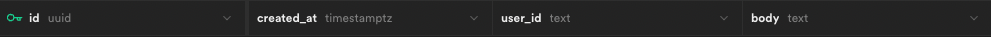
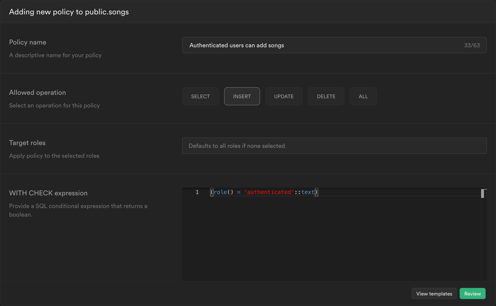
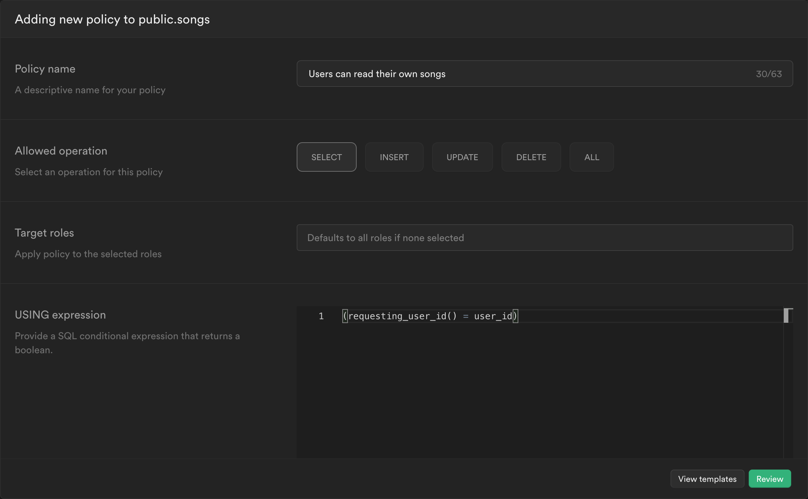

# Remix Bossa Nova Stack

Learn more about [Remix Stacks](https://remix.run/stacks).

## What's in the stack

-   User management with [Clerk](https://clerk.dev)
-   Database with [Supabase](https://supabase.com)
-   Styling with [Chakra UI](https://chakra-ui.com)
-   Deployment with [Vercel](https://www.vercel.com)
-   End-to-end testing with [Cypress](https://cypress.io)
-   Unit testing with [Jest](https://jestjs.io) and [Testing Library](https://testing-library.com)
-   Code formatting with [Prettier](https://prettier.io)
-   Linting with [ESLint](https://eslint.org)
-   Static Types with [TypeScript](https://typescriptlang.org)

## Development

### Installation

Create a new Remix app using the Bossa Nova Stack template:

```sh
npx create-remix@latest --template clerkinc/remix-bossa-nova-stack <app-name>
```

### Environment variables

For this step, you'll need a [Clerk application](https://dashboard.clerk.dev). Check out the Clerk docs for more information about [setting it up.](https://clerk.dev/docs/how-to/set-up-your-application)

You'll also need a [Supabase project](https://app.supabase.com/).

Finally, if you've already entered your environment variables during the `Installation` step, this step can be skipped.

Navigate into your project directory:

```sh
cd <app-name>
```

Create a `.env` file:

```sh
touch .env
```

Find your Clerk [Frontend API key and Backend API key](https://dashboard.clerk.dev/last-active?path=api-keys) and your [Supabase URL and anon key](https://supabase.com/docs/guides/api#api-url-and-keys) and add them to that file like this:

```
CLERK_FRONTEND_API=<YOUR_FRONTEND_API_KEY>
CLERK_API_KEY=<YOUR_BACKEND_API_KEY>
SUPABASE_URL=<YOUR_SUPABASE_URL>
SUPABASE_ANON_KEY=<YOUR_SUPABASE_ANON_KEY>
```

### Configuring the database

This template comes pre-configured to make calls to a [Supabase database](https://supabase.com/database).

To make authenticated calls to a Supabase database, you'll need to use one of Clerk's handy [JWT Templates](https://clerk.dev/docs/how-to/jwt-templates). Check out our [detailed instructions about setting up Clerk and Supabase](https://clerk.dev/docs/integration/supabase).

> ❗️ This project is configured to use a JWT template named `supabase`, so use the same value when creating your JWT template on the [Clerk Dashboard](https://dashboard.clerk.dev/last-active?path=jwt-templates). Alternatively, you can change this value in `/app/utils/db.server.ts`.

Also, you'll need to create a table called `songs` with the following columns in your Supabase database:

| Column name | Column type |
| ----------- | ----------- |
| id          | uuid        |
| created_at  | timestamptz |
| user_id     | text        |
| body        | text        |

In the end, it should look like this:



Next, we need to ensure that only authenticated users can add new songs and that these users can only retrieve songs they've added.
For that, we'll enable RLS for the newly created `songs` table.
Head over to the SQL editor on your Supabase project, paste and run the following query:

```sql
create or replace function requesting_user_id()
returns text
language sql stable
as $$
  select nullif(current_setting('request.jwt.claims', true)::json->>'sub', '')::text;
$$;
```

This will create a `requesting_user_id()` function that can be used within an RLS policy.

Now, navigate to "Authentication", then "Policies", enable RLS for the `songs` table, if not yet enabled, and create two new policies from scratch.

One for inserting new songs:



And one for selecting existing songs:



Your database is now fully configured and protected.

### Running the app

Start your development instance:

```sh
npm run dev
```

Visit http://localhost:3000. If everything is set up correctly, you should see something that looks like this:


That's it! You're all set to start building your Remix application with complete user management provided by [Clerk](https://clerk.dev).

## Styling

This template is pre-configured to use Chakra styling. For more information about it, check out the [Chakra documentation](https://chakra-ui.com/docs).

## Deployment

You only need to [import your Git repository](https://vercel.com/new) into Vercel, and it will be deployed.

If you'd like to avoid using a Git repository, you can also deploy the directory by running [Vercel CLI](https://vercel.com/cli):

```sh
npm i -g vercel
vercel
```

It is generally recommended to use a Git repository, because future commits will then automatically be deployed by Vercel, through its [Git Integration](https://vercel.com/docs/concepts/git).

## Testing

### Cypress

Cypress is used for the End-to-End tests in this project. You'll find those in the `cypress` directory. You'll find included Cypress's example files to help you on your way, but for more information on Cypress, [check out their official documentation](https://docs.cypress.io/guides/core-concepts/introduction-to-cypress).

### Jest/Testing Library

For lower level tests of utilities and individual components, this project uses [Jest](https://jestjs.io/) and [Testing Library](https://testing-library.com).

### Type Checking

This project uses TypeScript. It's recommended to get TypeScript set up for your editor to get a really great in-editor experience with type checking and auto-complete. To run type checking across the whole project, run `npm run typecheck`.

### Linting

This project uses ESLint for linting. That is configured in `.eslintrc.js`.

### Formatting

This project uses [Prettier](https://prettier.io/) for auto-formatting in this project. It's recommended to install an editor plugin (like the [VSCode Prettier plugin](https://marketplace.visualstudio.com/items?itemName=esbenp.prettier-vscode)) to get auto-formatting on save. There's also a `npm run format` script you can run to format all files in the project.
